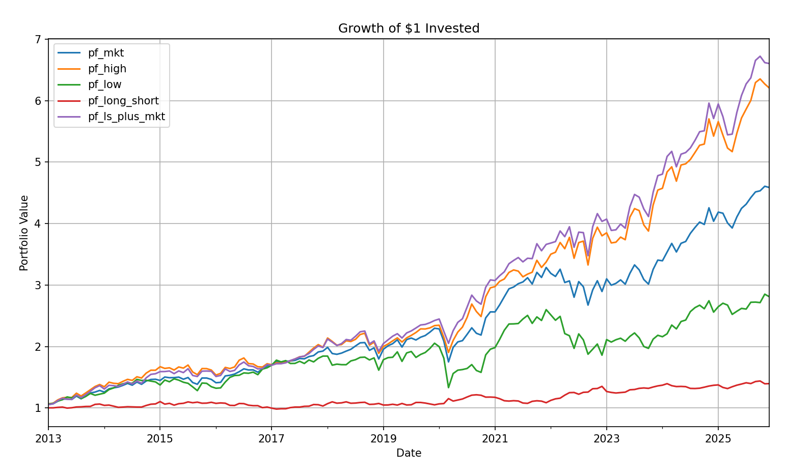

# Cross-Sectional Momentum Strategy 
This repository contains several indices and their monthly data points from 2012 until 2025.

The ***momentum_strategy_analysis.py*** file contains the code to extract, analyze and backtest 5 different portfolios based on that data: all with different strategies. 
>[!Warning] 
The python file contains verification code to the check the calculated values against reference values, making sure the computations are correct. Do not change the reference values, as they are used to verify the calculations.

The ***answering_questions.py*** file contains the code to answer some questions related to the momentum strategy to extract more information, using the results from the analysis.

Here is the cumulative growth of $1 invested in each of the 5 portfolios, over the period January 2013 until December 2025:

